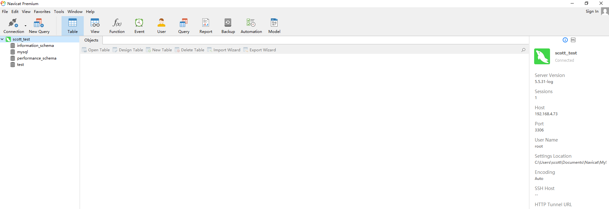

# 自动填充工具使用说明
自动填充工具是一款打开app并进行对应操作的自动化程序。所有的操作都在json文件中进行定义，如 navicate-premium.json

本文档主要介绍如何添加一款app，并利用自动填充工具实现目标操作

## 新增app，实现自动填充
这里以添加navicat-premium工具的自动，填充连接到mysql数据库为例，介绍实现步骤

* 前提条件:
    - os: windows操作系统
    - 已安装python3并可运行python
    - navicat-premium已安装并可运行

* 一个已连接的navicat-premium图示如下
    

### 环境设置

打开cmd命令并进入填充工具代码库文件夹。如f:/yyf_work_sta/cloudSoft-cpp/AppAutoFill

1. win + r 并输入cmd打开cmd

2. 键入 cd "f:/yyf_work_sta/cloudSoft-cpp/AppAutoFill"并回车,然后键入f: 进入目的文件夹 

3. 输入set APPLAUNCHER_DEBUG=1,打开debug信息
    
### 配置自动填充的json文件
这里实现在navicat中打开连接并新创建一个连接，最后连接到数据库

* 插件信息如下,以:为分隔符，从第3列开始，他们分别是class id text,括号中的四个数字分别是插件
  左上角横坐标，纵坐标 右上角的横坐标和纵坐标。
    ```bash
    13456:0x5f0960:TActionMainMenuBar:6228320:ActionMainMenuBar ->(0, 23, 1920, 50)
    ```
* 这里通过查找插件信息来确认操作对象，规则如下：
    * 如果id能确定且在多次打开时保持不变，优先使用id
    * 如果有text值，使用text值
    * 如果有class值，使用class值
    * 如果上述值有多个，则使用参数"seq"确认需要选取的插件，seq以int值0为第一个数值

* 自动代填支持对操作对象（窗口句柄）进行下列操作：
    * keyboard：向目标对象发送键盘事件，参数格式如下, 第一个参数表示需要先在控件上点击鼠标的相对位置，[0,0]
    表示不点击鼠标；第二个参数为键盘输入的内容，支持字符串以及大小写；第三个参数可选，支持CTRL和ALT
        ```bash
              {
                "desc": "用快捷键打开连接窗口",
                "target": {},
                "event" : "keyboard",
                "param": [[0, 0], "u", "ctrl"],
                "wait": 2
              },
        ```
    * mouse: 向目标对象发送鼠标点击事件，参数格式如下，第一个参数标识在控件上点击鼠标的相对位置，第二个参数表示
    是点击左键还是右键。
        ```bash
              {
                "desc": "点击OK按钮",
                "target": {
                  "text": "OK"
                },
                "event" : "mouse",
                "param": [[10, 10], "left"],
                "wait": 2
              },
        ```
    * message: 向目标对象发送windows message事件，一般为WM_SETTEXT，设置文本信息，第一个参数为消息类型，第二个参数
    为消息内容。
        ```bash
              {
                "desc": "输入IP地址",
                "target": {
                  "text": "127.0.0.1"
                },
                "event" : "message",
                "param": ["WM_SETTEXT", "192.168.4.40"],
                "wait": 0.1
              },
        ```
    * hide: 隐藏目标对象，通常为输入法窗口
        ```bash
              {
                "desc": "隐藏输入法，此步骤可能失败，但是失败后仍然继续",
                "target": {
                  "desc": "类型为NativeHWNDHost的控件",
                  "class": "NativeHWNDHost",
                  "seq":0
                },
                "event": "hide",
                "param": [true],
                "wait": 0.1,
                "continue":true
              },
        ```

1. 创建配置文件。配置文件为app名即可，这里创建navicate-premium.json文件
    1. 拷贝当前test目录下的template.json，改为navicate-premium.json
    2. 按实际情况和提示修改navicate-premium.json文件中的参数。如下
        ```bash
           {
              "name": "navicate-premium",
              "path": "F:\\Navicat\\navicat.exe",
              "callback": "http://127.0.0.1:8080/callback",
              "autoFillInfo": {
                "title": "",
                "timeout": 10,
                "maximize": false,
                "action": [
                ]
              },
              "postrun": {
              }
           }
        ```
    3. 创建一个简单的web服务器，把navicat.json copy到服务器下，web服务器简单的代码在web_server_simulator.py，下载下来，在同目录创建test目录，将navicate-premium.json复制到test目录即可。然后运行下列命令
    ```bash
    python3 web_server_simulator.py
    ```
   
2. 运行配置AppLauncher.exe，获取插件信息，并逐步实现连接数据库的操作
    1. 在cmd中执行执行 AppLauncher.exe http://127.0.0
    .1:8080/req?app=navicat-premium。app名称为test目录下json的前缀。这里会将navicat打开并在日志中输出下列信息
        ```bash
        find windows <win_app.win_app object at 0x04095FB0>(pid 13456, hwnd [<window_handler.window_handler object at 0x04367850>]) target {'text': '^Navicat'}
        dump all child window info
        13456:0x1100a86:TNavicatMainForm:0:Navicat Premium ->(-8, -8, 1928, 1048)
        13456:0x8e0ce4:TPanel:9309412: ->(1670, 114, 1920, 1018)
        13456:0x480484:TPanel:4719748: ->(1670, 139, 1920, 1018)
        13456:0x19063a:TNavicatSyncActivityLog:1639994: ->(1670, 139, 1920, 1018)
        13456:0x2a0160:TPanel:2752864:No object information available. ->(1670, 139, 1920, 1018)
        13456:0x30014e:TPanel:3146062: ->(1670, 114, 1920, 139)
        13456:0x480552:TPanel:4719954:PanelNSYUserInfo ->(1847, 23, 1920, 48)
        13456:0x5d0730:TPanel:6096688:plNSYSpace ->(1887, 23, 1895, 48)
        13456:0x48057e:TPanel:4719998: ->(0, 1018, 1920, 1040)
        13456:0x1e02c0:TStatusBar:1966784: ->(0, 1018, 1920, 1040)
        13456:0x5b0aaa:TPanel:5966506: ->(1869, 1019, 1919, 1040)
        13456:0x590c5a:TPanel:5835866: ->(1798, 1019, 1865, 1040)
        13456:0x3f084c:TPanel:4130892:PanelNavTabs ->(253, 114, 1667, 1018)
        13456:0xc0274:TPanel:787060: ->(253, 114, 1667, 144)
        13456:0x990cbe:TPanel:10030270: ->(253, 140, 1667, 144)
        13456:0x240c50:TNavicatRkSmartTabs:2362448: ->(253, 114, 1667, 140)
        13456:0x170ace:TPanel:1510094:PanelDockHost ->(253, 144, 1667, 1018)
        13456:0x29038a:TPanel:2687882: ->(253, 144, 1667, 1018)
        13456:0x2a0c94:TPanel:2755732: ->(253, 144, 1667, 170)
        13456:0x50070c:TPanel:5244684: ->(253, 144, 1638, 170)
        13456:0x3d081e:TActionToolBar:3999774:ActionToolBar2 ->(253, 144, 1638, 171)
        13456:0x3105a2:TPanel:3212706: ->(1638, 144, 1662, 170)
        13456:0x5d074a:TPanel:6096714: ->(253, 170, 1667, 1018)
        13456:0x450710:TPanel:4523792: ->(253, 170, 1667, 1018)
        13456:0x8506a2:TDiagramViewFrame:8717986: ->(253, 170, 807, 638)
        13456:0x2b05ae:TPanel:2819502: ->(253, 170, 807, 608)
        13456:0x2b0a36:TDDViewer:2820662: ->(253, 170, 807, 608)
        13456:0x59040a:TPanel:5833738: ->(253, 608, 807, 638)
        13456:0x3c041a:TPanel:3933210: ->(253, 608, 667, 638)
        13456:0x6b0a30:TActionToolBar:7014960:DiagramViewFrameToolBar ->(253, 611, 667, 638)
        13456:0xb5078e:TListView:11863950: ->(253, 170, 1667, 1018)
        13456:0x4205f0:TWinControlProxy:4326896: ->(253, 170, 253, 170)
        13456:0x3d0a0a:TActionToolBar:4000266:ActionToolBar ->(0, 50, 1920, 114)
        13456:0x5f0960:TActionMainMenuBar:6228320:ActionMainMenuBar ->(0, 23, 1920, 50)
        13456:0x290958:TPanel:2689368: ->(0, 114, 250, 1018)
        13456:0x330d02:TVTFilterFrame:3345666: ->(0, 114, 250, 1018)
        13456:0x1b0744:TVirtualStringTree:1771332: ->(0, 114, 250, 1018)
        13456:0x30065a:TWinControlProxy:3147354: ->(0, 114, 0, 114)
        Starting new HTTP connection (1): 127.0.0.1:8080
        http://127.0.0.1:8080 "GET /callback?success=true&msg= HTTP/1.1" 200 None
        Proc 13456 exits with code 0
        Exec post run for navicate-premium
        Starting new HTTP connection (1): 127.0.0.1:8080
        http://127.0.0.1:8080 "GET /callback?sessionClose=True HTTP/1.1" 200 None
        ```
    
    2. 分析上一步骤的日志信息，找到**file**对应的插件，实现鼠标移动到菜单插件**File**上
        * 初步分析**file**插件在左上角，所以可在上面的日志中排除左上角横坐标过大的插件。
        * 将可能的插件放入到在navicate-premium.json中的action中，
            * 键值说明如下
                - target: 确定需要获取的插件
                - event: 动作消息。如鼠标，发送消息
                - param: 参数。值为一个数组，数组中第一个值为数组则为鼠标偏移量，后面接鼠标的点击动作；
                如果event是发送消息，则param为设置消息，第一个参数为动作，第二个参数为值
            * 在尝试多次后，加入内容如下到aciton中可实现鼠标点击**file**菜单。注：这里也可以通过工具来辅助找到插件
                ```bash
                    {
                    "target": {
                      "text": "ActionMainMenuBar"
                    },
                    "event": "mouse",
                    "param": [
                      [
                        10,
                        10
                      ],
                      "left"
                    ],
                    "wait": 0.5
                      }
                ```
            
    3. 重启步骤1中的exe程序，获取鼠标的插件信息。获取以下的日志信息，其中before exec是执行鼠标左键点击file前的插件信息；
    After exec 是执行鼠标点击后的插件信息，这里我们应该去鼠标点击后的插件
        ```bash
            ====================begin====================
            before exec action {'target': {'text': 'ActionMainMenuBar'}, 'event': 'mouse', 'param': [[10, 10], 'left'], 'wait': 0.5}
            find windows <win_app.win_app object at 0x0346B070>(pid 11576, hwnd [<window_handler.window_handler object at 0x037897F0>]) target {'text': 'ActionMainMenuBar'}
            dump all child window info
            11576:0x7b07c2:TNavicatMainForm:0:Navicat Premium ->(-8, -8, 1928, 1048)
            11576:0xbb0ad8:TPanel:12258008: ->(1670, 114, 1920, 1018)
            11576:0xc10ae2:TPanel:12651234: ->(1670, 139, 1920, 1018)
            11576:0x50b44:TNavicatSyncActivityLog:330564: ->(1670, 139, 1920, 1018)
            11576:0x320a38:TPanel:3279416:No object information available. ->(1670, 139, 1920, 1018)
            11576:0x2c0af0:TPanel:2886384: ->(1670, 114, 1920, 139)
            11576:0x1c0ae6:TPanel:1837798:PanelNSYUserInfo ->(1847, 23, 1920, 48)
            11576:0x210b3c:TPanel:2165564:plNSYSpace ->(1887, 23, 1895, 48)
            11576:0x6f0780:TPanel:7276416: ->(0, 1018, 1920, 1040)
            11576:0x2d05c4:TStatusBar:2950596: ->(0, 1018, 1920, 1040)
            11576:0x22607c0:TPanel:36046784: ->(1869, 1019, 1919, 1040)
            11576:0x3c0abe:TPanel:3934910: ->(1798, 1019, 1865, 1040)
            11576:0x530554:TPanel:5440852:PanelNavTabs ->(253, 114, 1667, 1018)
            11576:0x150b40:TPanel:1379136: ->(253, 114, 1667, 144)
            11576:0x1d0b66:TPanel:1903462: ->(253, 140, 1667, 144)
            11576:0x1e06bc:TNavicatRkSmartTabs:1967804: ->(253, 114, 1667, 140)
            11576:0x3804f0:TPanel:3671280:PanelDockHost ->(253, 144, 1667, 1018)
            11576:0x530ab8:TPanel:5442232: ->(253, 144, 1667, 1018)
            11576:0x300b20:TPanel:3148576: ->(253, 144, 1667, 170)
            11576:0x1305fe:TPanel:1246718: ->(253, 144, 1638, 170)
            11576:0x170b42:TActionToolBar:1510210:ActionToolBar2 ->(253, 144, 1638, 171)
            11576:0x3c057a:TPanel:3933562: ->(1638, 144, 1662, 170)
            11576:0x2a0066:TPanel:2752614: ->(253, 170, 1667, 1018)
            11576:0x90b78:TPanel:592760: ->(253, 170, 1667, 1018)
            11576:0x25064e:TDiagramViewFrame:2426446: ->(253, 170, 807, 638)
            11576:0x1d0692:TPanel:1902226: ->(253, 170, 807, 608)
            11576:0x1205e8:TDDViewer:1181160: ->(253, 170, 807, 608)
            11576:0x2805bc:TPanel:2622908: ->(253, 608, 807, 638)
            11576:0x9307b2:TPanel:9635762: ->(253, 608, 667, 638)
            11576:0x130682:TActionToolBar:1246850:DiagramViewFrameToolBar ->(253, 611, 667, 638)
            11576:0x380b14:TListView:3672852: ->(253, 170, 1667, 1018)
            11576:0x3d0820:TWinControlProxy:3999776: ->(253, 170, 253, 170)
            11576:0x410574:TActionToolBar:4261236:ActionToolBar ->(0, 50, 1920, 114)
            11576:0x3d0cee:TActionMainMenuBar:4001006:ActionMainMenuBar ->(0, 23, 1920, 50)
            11576:0x640be2:TPanel:6556642: ->(0, 114, 250, 1018)
            11576:0x170c2a:TVTFilterFrame:1510442: ->(0, 114, 250, 1018)
            11576:0x300a06:TVirtualStringTree:3148294: ->(0, 114, 250, 1018)
            11576:0x860ce2:TWinControlProxy:8785122: ->(0, 114, 0, 114)
            Post event mouse to 11576:0x3d0cee:TActionMainMenuBar:4001006:ActionMainMenuBar ->(0, 23, 1920, 50)
            Move mouse to (10,33)
            Click mouse with button LEFT
            After exec action {'target': {'text': 'ActionMainMenuBar'}, 'event': 'mouse', 'param': [[10, 10], 'left'], 'wait': 0.5}
            dump all child window info
            11576:0x5a06ae:TThemedPopupMenu:0: ->(1, 49, 191, 297)
            ====================end====================
        ```
    
    4. 利用鼠标插件实现鼠标移动。由于步骤3中执行后只有1个插件信息，所以我们在action中添加内容如下。
        ```bash
        {
                "target": {
                  "class": "TThemedPopupMenu"
                },
                "event": "mouse",
                "param": [
                  [
                    10,
                    30
                  ],
                  ""
                ],
                "wait": 0.5
        }
        ```
        
    5. 重复步骤3和步骤4，一步一步实现最终连接数据库的目的。得到的json文件内容如下
        ```bash
        {
          "name": "navicate-premium",
          "path": "F:\\Navicat\\navicat.exe",
          "callback": "http://127.0.0.1:8080/callback",
          "autoFillInfo": {
            "title": "^Navicat",
            "timeout": 10,
            "maximize": false,
            "action": [
              {
                "target": {
                  "text": "ActionMainMenuBar"
                },
                "event": "mouse",
                "param": [
                  [
                    10,
                    10
                  ],
                  "left"
                ],
                "wait": 0.5
              },
              {
                "target": {
                  "class": "TThemedPopupMenu"
                },
                "event": "mouse",
                "param": [
                  [
                    10,
                    30
                  ],
                  ""
                ],
                "wait": 0.5
              },
              {
                "target": {
                  "class": "TThemedPopupMenu"
                },
                "event": "mouse",
                "param": [
                  [
                    50,
                    10
                  ],
                  ""
                ],
                "wait": 0.5
              },
              {
                "target": {
                  "class": "TThemedPopupMenu"
                },
                "event": "mouse",
                "param": [
                  [
                    10,
                    10
                  ],
                  "left"
                ],
                "wait": 0.5
              },
              {
                "target": {
                  "class": "TEdit",
                  "seq": 4
                },
                "event": "message",
                "param": [
                  "WM_SETTEXT",
                  "scott_test"
                ]
              },
              {
                "target": {
                  "class": "TEdit",
                  "seq": 0
                },
                "event": "message",
                "param": [
                  "WM_SETTEXT",
                  "192.168.4.73"
                ]
              },
              {
                "target": {
                  "class": "TEdit",
                  "seq": 3
                },
                "event": "message",
                "param": [
                  "WM_SETTEXT",
                  "3306"
                ]
              },
              {
                "target": {
                  "class": "TEdit",
                  "seq": 2
                },
                "event": "message",
                "param": [
                  "WM_SETTEXT",
                  "root"
                ]
              },
              {
                "target": {
                  "class": "TEdit",
                  "seq": 1
                },
                "event": "message",
                "param": [
                  "WM_SETTEXT",
                  "sky123"
                ]
              },
              {
                "target": {
                  "class": "TButton",
                  "text": "OK"
                },
                "event": "mouse",
                "param": [
                  [
                    10,
                    10
                  ],
                  "left"
                ],
                "wait": 0.5
              },
              {
                "desc": "action",
                "target": {
                  "class": "TVirtualStringTree"
                },
                "event": "mouse",
                "param": [
                  [
                    20,
                    10
                  ],
                  "right"
                ],
                "wait": 1
              },
              {
                "target": {
                  "class": "#32768"
                },
                "event": "mouse",
                "param": [
                  [
                    20,
                    10
                  ],
                  "left"
                ],
                "wait": 1
              }
            ]
          },
          "postrun": [
            
              ]
        }
        ```
    
    6. 实现关闭app后的清除连接工作。这可以在json文件的postrun参数中定义。以下是删除navicat中的连接串的定义，可以供参考
        ```bash
               {
                  "action": "fileclean",
                  "params": [
                    "%USERPROFILE%\\Documents\\Navicat"
                  ]
                },
                {
                  "action": "regclean",
                  "params": [
                    "HKEY_CURRENT_USER\\Software\\PremiumSoft\\Navicat\\Servers"
                  ]
                },
                {
                  "action": "command",
                  "params": [
                    "echo",
                    "test"
                  ]
                }
        ```
        
    7. 最终的json文件内容如下
        ```bash
            {
              "name": "navicate-premium",
              "path": "F:\\Navicat\\navicat.exe",
              "callback": "http://127.0.0.1:8080/callback",
              "autoFillInfo": {
                "title": "^Navicat",
                "timeout": 10,
                "maximize": false,
                "action": [
                  {
                    "target": {
                      "text": "ActionMainMenuBar"
                    },
                    "event": "mouse",
                    "param": [
                      [
                        10,
                        10
                      ],
                      "left"
                    ],
                    "wait": 0.5
                  },
                  {
                    "target": {
                      "class": "TThemedPopupMenu"
                    },
                    "event": "mouse",
                    "param": [
                      [
                        10,
                        30
                      ],
                      ""
                    ],
                    "wait": 0.5
                  },
                  {
                    "target": {
                      "class": "TThemedPopupMenu"
                    },
                    "event": "mouse",
                    "param": [
                      [
                        50,
                        10
                      ],
                      ""
                    ],
                    "wait": 0.5
                  },
                  {
                    "target": {
                      "class": "TThemedPopupMenu"
                    },
                    "event": "mouse",
                    "param": [
                      [
                        10,
                        10
                      ],
                      "left"
                    ],
                    "wait": 0.5
                  },
                  {
                    "target": {
                      "class": "TEdit",
                      "seq": 4
                    },
                    "event": "message",
                    "param": [
                      "WM_SETTEXT",
                      "scott_test"
                    ]
                  },
                  {
                    "target": {
                      "class": "TEdit",
                      "seq": 0
                    },
                    "event": "message",
                    "param": [
                      "WM_SETTEXT",
                      "192.168.4.73"
                    ]
                  },
                  {
                    "target": {
                      "class": "TEdit",
                      "seq": 3
                    },
                    "event": "message",
                    "param": [
                      "WM_SETTEXT",
                      "3306"
                    ]
                  },
                  {
                    "target": {
                      "class": "TEdit",
                      "seq": 2
                    },
                    "event": "message",
                    "param": [
                      "WM_SETTEXT",
                      "root"
                    ]
                  },
                  {
                    "target": {
                      "class": "TEdit",
                      "seq": 1
                    },
                    "event": "message",
                    "param": [
                      "WM_SETTEXT",
                      "sky123"
                    ]
                  },
                  {
                    "target": {
                      "class": "TButton",
                      "text": "OK"
                    },
                    "event": "mouse",
                    "param": [
                      [
                        10,
                        10
                      ],
                      "left"
                    ],
                    "wait": 0.5
                  },
                  {
                    "desc": "action",
                    "target": {
                      "class": "TVirtualStringTree"
                    },
                    "event": "mouse",
                    "param": [
                      [
                        20,
                        10
                      ],
                      "right"
                    ],
                    "wait": 1
                  },
                  {
                    "target": {
                      "class": "#32768"
                    },
                    "event": "mouse",
                    "param": [
                      [
                        20,
                        10
                      ],
                      "left"
                    ],
                    "wait": 1
                  }
                ]
              },
              "postrun": [
                {
                  "action": "fileclean",
                  "params": [
                    "%USERPROFILE%\\Documents\\Navicat"
                  ]
                },
                {
                  "action": "regclean",
                  "params": [
                    "HKEY_CURRENT_USER\\Software\\PremiumSoft\\Navicat\\Servers"
                  ]
                },
                {
                  "action": "command",
                  "params": [
                    "echo",
                    "test"
                  ]
                }
              ]
            }
        ```
        
## 运行程序
完成配置后，可关闭调试日志，然后测试是否可以实现自动连接数据库

### 环境配置
* 在cmd中设置变量，以取消调试日志
    ```bash
       set APPLAUNCHER_DEBUG=0
    ```

### 运行程序。
* 在cmd中执行以下程序
    ```bash
       AppLauncher.exe http://127.0.0.1:8080/req?app=navicat-premium
    ```
